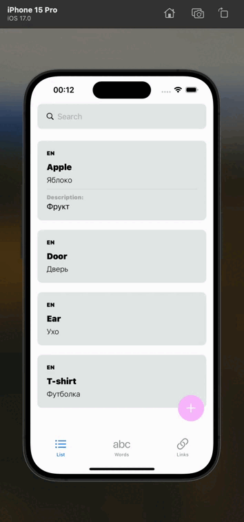

# LanguageLearningApp



LanguageLearningApp is a SwiftUI-based application developed in Xcode 15. It is designed to help users expand their vocabulary by managing and reviewing words. The app offers an intuitive interface for adding new words, viewing random words from the list, and saving useful links related to language learning.

## Features

- **Word List Management:** Easily add new words to your vocabulary list. The list provides a clear overview of all the words you’ve added.
- **Random Word Display:** View a random word from your list on a dedicated screen. This feature helps reinforce learning by showing words unexpectedly.
- **Links Management:** Save and manage useful links related to language learning. Open these links directly within the app, and add new ones as needed.

## Installation

1. Clone the repository:
    ```bash
    git clone https://github.com/anikin02/LanguageLearningApp.git
    ```
2. Open the project in Xcode:
    ```bash
    cd LanguageLearningApp
    open LanguageLearningApp.xcodeproj
    ```
3. Run the project on a simulator or a real device.
